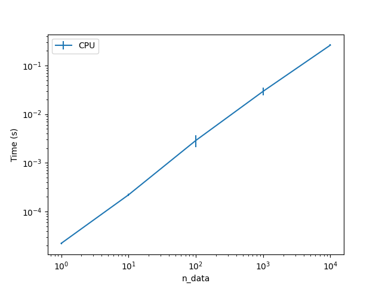
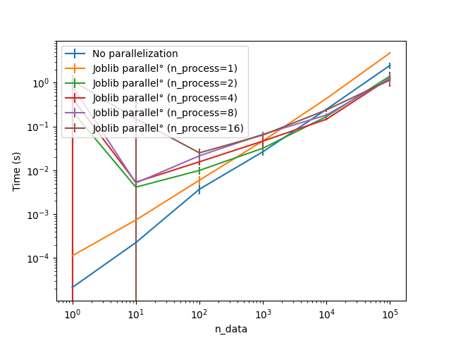
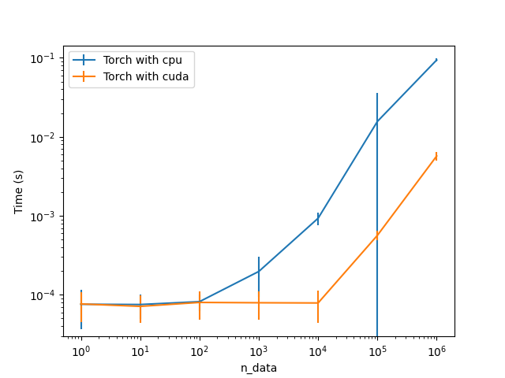
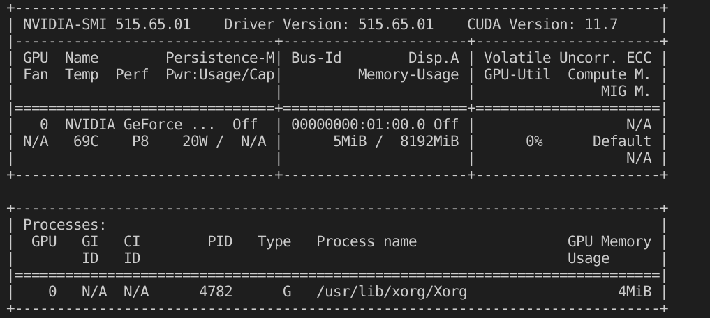

# Local Python performance measurement

This project aims to create an easy-to-use package for measuring the performance of python in any machine, in terms of CPU, multiprocessing and GPU (pytorch with CUDA), and also verify that the GPU is used.

# Installation

Install the requirements in requirements.txt, then install from source:

```bash
pip install -U git+git://github.com/tboulet/Local-Python-Performance.git
```


# Usage

You can measure the performance of your machine in terms of CPU, multiprocessing and GPU (pytorch and tensorflow) by running the commands below.

Relevant arguments for visualization are:
- `--plot` : plot the results (default False)
- `--log_dir` [log directory] : directory where to save the results (default no logging)
- `--image_dir` [image directory]: directory where to save the images (default no image saving)
- `--no-progess` : do not show progress bar (default behavior is to show)

# CPU

<p align="center">
  
</p>

To measure the performance of your machine in terms of CPU, run the following command:
```bash
python3 -m localperf.cpu
```

Relevant arguments for the benchmark are:
- `log_n_data` [log n data] : maximum number of data to do the benchmark (in log10 scale)
- `n_measures` [n measures] : number of measures to do for each data size

# Multiprocessing

<p align="center">
  
</p>

To measure the performance of your machine in terms of multiprocessing, run the following command:
```bash
python3 -m localperf.multiprocessing
```

Relevant arguments for the benchmark are:
- `log_n_data` [log n data] : maximum number of data to do the benchmark (in log10 scale)
- `log2_n_process` [log2 n process] : maximum number of processes to do the benchmark (in log2 scale)
- `n_measures` [n measures] : number of measures to do for each data size

# GPU (pytorch)

## Install CUDA for pytorch

<p align="center">
  
</p>

First, install pytorch with CUDA following the instructions on the [pytorch website](https://pytorch.org/get-started/locally/). 
If this code returns `True`, it means pytorch and CUDA are installed and its a good sign your GPU is used but this is not a guarantee:
```python
import torch
print(torch.cuda.is_available())
```
You may use the command `nvidia-smi` to check if your GPU is recognized by the system.

    nvidia-smi
<p align="center">
  
</p>
This give you information about each GPU recognized by the system : the name, the VRAM used. You can run this command in a separate terminal to see the GPU usage during your code :

    watch -n 0.1 nvidia-smi

## Run the benchmark

To measure the performance of your machine in terms of GPU, run the following command:
```bash
python3 -m localperf.gpu_torch
```
Relevant arguments for the benchmark are:
- `log_n_data` [log n data] : maximum number of data to do the benchmark (in log10 scale)
- `n_measures` [n measures] : number of measures to do for each data size
- `n_measures_gpu` [n measures gpu] : number of measures to do for each data size, on the GPU. If not specified, the same number of measures as on the CPU is done.